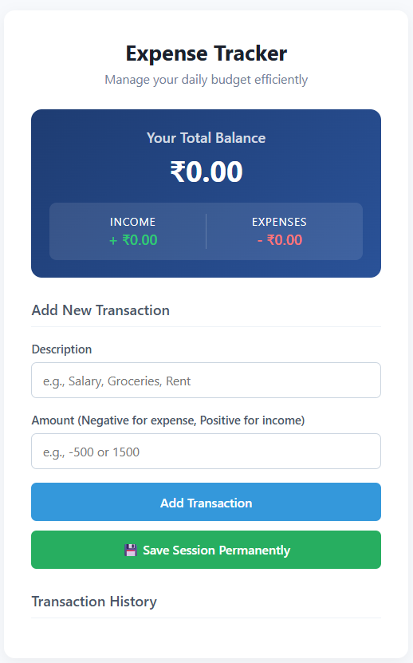

# Personal Expense Tracker

A clean, responsive, and performance-optimized single-page web utility designed for tracking personal micro-finance transactions, calculating net cash flows, and generating real-time dynamic ledger summaries.



## 🚀 Live Deployment

The production build is fully compiled, hosted, and accessible globally:
**Live Demo:** [https://divyaprasoon-expense.vercel.app/](https://divyaprasoon-expense.vercel.app/)

---

## 🛠️ Architecture & Specifications

This application was engineered from the ground up prioritizing zero third-party dependencies, layout rendering efficiency, and precise state isolation.

- **Frontend Engine:** Semantic HTML5 structured layout paired with component-driven modern CSS layers.
- **Logical Runtime:** Vanilla JavaScript (ES6+) leveraging asynchronous execution behaviors and dynamic DOM mutation pipelines.
- **Data Aggregation:** Array data-structures manipulated via high-order functional methods (`.map()`, `.filter()`, and `.reduce()`) to perform transactional math computations.
- **State Persistence Implementation:** Implements an explicitly controlled `window.localStorage` optimization pipeline. This application introduces an absolute state-locking gateway—data persists across browser sessions exclusively when authorized manually by the user.

---

## 💎 Core Features

- **Dynamic Ledger Analytics:** Displays absolute real-time net-balance totals alongside individual dynamic income and expense statistical modules.
- **Transactional CRUD Pipelines:** Users can smoothly register new entries or discard historical nodes directly from the UI history thread.
- **User-Triggered Session Backup:** Introduces an intuitive cache persistence controller via a manual preservation button (`💾 Save Session Permanently`).
- **Airtight Hydration Checks:** On system initialization, an automated system daemon safely scans local storage and queries the client to prompt or decline historic profile recovery.

---

## 💻 Codebase Anatomy

```text
expense-tracker/
├── index.html   # Structural semantics
├── style.css    # Premium gradient layout sheets
├── script.js    # State management and math logic
└── preview.png  # UI preview asset
```
